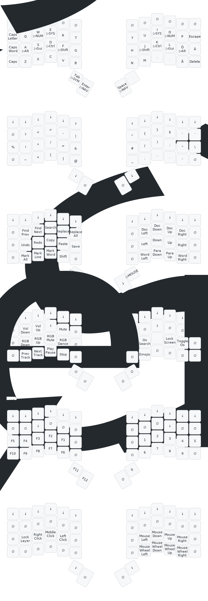

# Symmetra-keyboard-layout

QMK layout for my ZSA Voyager.

## Reasons Behind the Design
 
I have deliberately chosen not to use the top row of the voyager, partially in order to _stay_ forward-compatible with other 3×6 layouts, and partially to reduce finger travel.

## Keywords

_qwerty_, _nordic_, _swedish_, _symmetrical_, _40-keys_, _homerow mods_,  _2-row numpad_, _mouse_, _win-mac_, _OS-toggle_

## Layers

