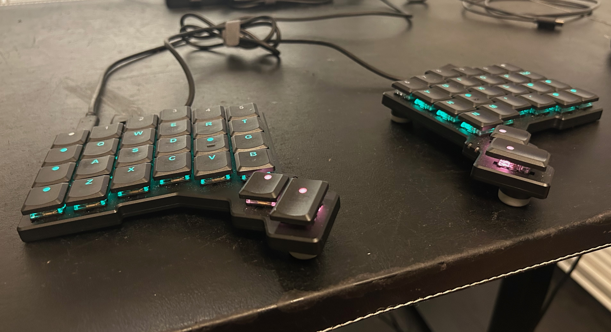
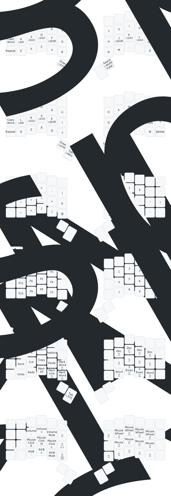

# Symmetra W H

QMK layout for my ZSA Voyager.

I have deliberately chosen not to use the top row of the Voyager, partly to _stay_ forward-compatible with other 3×6 + thumb key layouts, and partly to reduce finger travel. 

## Keywords

`qwerty`, `nordic`, `swedish`, `40-keys`, `symmetrical`, `homerow-mods`, `vim-navigation`, `mouse-layer`, `edit-cluster`, `win-mac`, `OS-toggle`

## Layers

## Key Translations

Legend for symbols and special keys used in the SVG:

| Symbol       | Meaning                    |
|--------------|----------------------------|
| ◇            | Modifier                   |
| ▷            | Momentary Layer toggle     |
| 🔍           | Windows search / Spotlight | 
| 😀😎🤔😭     | Emoji menu                 |
| 🔒           | Lock screen                |
| 🔄🪟🍏       | Switch OS (Win/Mac)        |
| 📸           | Screenshot                 |
| ⏮️           | Previous track             | 
| ⏭️           | Next track.                | 
| ⏹️           | Stop                       | 
| ⏯️           | Play/Pause                 | 

## Visualization Pipeline

The QMK keymap.c is converted into a visual representation of all layers. qmk c2json generates a JSON file, a custom Python script (yamlFromJson.py) converts it to YAML with readable layer names and symbolic keys, and keymap-drawer produces the SVG.

The shell script visualize.sh automates all steps: creating a temporary symlink, generating JSON and YAML, and producing the SVG.

**Dependencies:**  
- QMK CLI (`qmk c2json`)  
- `keymap-drawer` Python module  
- Custom Python script: `yamlFromJson.py`  
- Shell script: `visualize.sh`

## Future Changes

I am planning on changing to the swedish [_Kvikk layout_](https://lykt.xyz/skl/kvikk/), which has been optimized and evaluated with Carplax optimization. The typing effort statistics looks fine for both english and swedish. I will begin by adding an alpha layer called ALPHA/1, which can be switched to from the MEDIA-layer's rightmost-key on the homerow, the one sandwiched between the os-toggle key and the lock-screen-key.    

|caps lock|x|c|o|ä|u|h|k|m|b|j     |w     |
|caps word|l|r|a|e|i|d|t|n|s|g     |v     |
|media    |q|z|å|ö|y|f|p|,|.|delete|escape|
