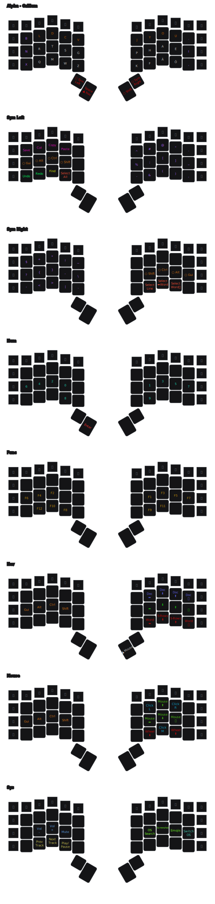

# Symmetra W H

QMK layout for my ZSA Voyager.

I have deliberately chosen not to use the top row of the Voyager, partly to _stay_ forward-compatible with other 3×6 + thumb key layouts, and partly to reduce finger travel.

My alpha layout is [Gallium](https://github.com/GalileoBlues/Gallium), with Swedish letters Ä, Ö, Å added via combos.


## Keywords

`gallium`, `win-mac`, `nordic`, `swedish`, `34-keys`, `one-shot-mods`, `combos`, `vim-navigation`, `mouse-layer`, `edit-cluster`, `getreuer-select-word`, `OS-toggle`

## Layers



## Key Translations

Legend for symbols and special keys used in the SVG:

| Symbol    | Meaning                           |
|-----------|-----------------------------------|
| ○         | One-shot (OSL layer / OSM mod)    |
| ▲         | Hold to activate layer (MO / LT)  |
| ⇔         | Toggle layer on/off (TG)          |
| 🔍        | Windows search / Spotlight        |
| 😀        | Emoji menu                        |
| 🔄 OS     | Toggle OS (Win/Mac)               |
| 📸        | Screenshot                        |
| ⏮️        | Previous track                    |
| ⏭️        | Next track                        |
| ⏯️        | Play/Pause                        |

## Visualization Pipeline

The keymap SVG is generated directly from `src/keymap.c` by a custom Python script.

```
python3 visualization/parse_keymap.py --svg visualization/keymap.svg
```

**Dependencies:**
- Python 3.11+
- No external Python packages required
