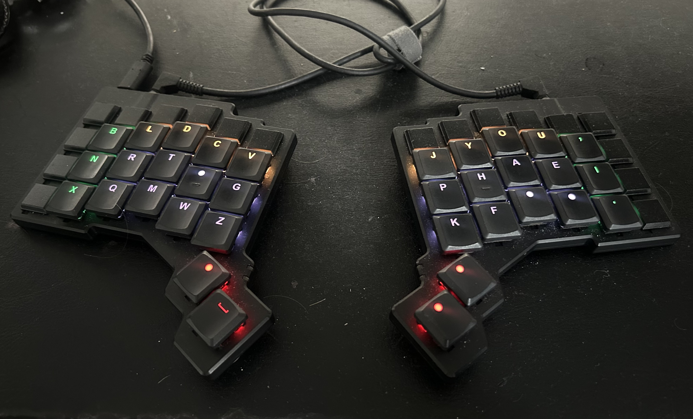
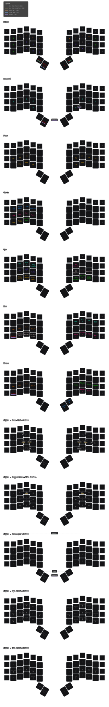

# Rhizome

> Named after the **rhizome** — a network with no center, where any node connects to any other. Few keys, richly connected by combos.

A 34-key QMK layout (3×5 + 2 thumbs per side) designed to minimize finger travel. Compatible with the ZSA Voyager as well as boards like the Ferris Sweep. I currently use a Voyager and have physically removed the switches in the top row and outer columns of the keyboard.

The layout is mainly inspired by [Jonas Hietala's T-34](https://www.jonashietala.se/blog/2021/06/03/the-t-34-keyboard-layout/). After finding out the hard way that home-row mods are not for me — too many timing issues — I moved to combos and the chord model instead.

My alpha layout is [Gallium](https://github.com/GalileoBlues/Gallium), with Swedish letters Ä and Ö on the base layer, and Å via a combo of the two. A dedicated OS toggle lets you switch between Mac and Windows shortcuts/commands on the fly — it is designed to be platform independent.



## Keywords

`rhizome`, `qmk`, `zsa-voyager`, `gallium`, `nordic`, `swedish`, `34-keys`, `chording`, `home-row-combos`, `combos`, `one-shot`, `vim-navigation`, `mouse-layer`, `edit-cluster`, `getreuer-select-word`, `repeat-key`, `caps-word`, `num-word`, `win-mac`, `OS-toggle`

## Layers

The keymap below shows key positions and RGB coloring for each layer. The keycaps in the outer columns and top row are rendered in a different geometry to reflect that those switches have been physically removed.   

A legend is added explaining the color-coded underlines used on action keys — each color represents a different action type: one-shot layer (OSL), one-shot modifier (OSM), momentary (MO), layer-tap (LT), and toggle (TG). 

Combos are not overlaid on the base layer; they are collected into dedicated panels below the layer views, drawn over the dimmed alpha letters for context and grouped by how they are triggered. Same-side combos are shown as overlay boxes on the affected keys, cross-side combos use dashed routing lines converging on a central indicator box, and thumb-anchored combos are labelled on their target key together with the thumb that triggers them.

A few keys are rendered with special symbols: `↻` for the Repeat key and `⌫` for Backspace.




## Design Rationale

The core idea is a **preference for chords over sequences** — where a sequence can mean order, duration, or both. A chord expresses intent through combination: two keys pressed together mean one thing, defined by *which* keys, not by any sequential action. A sequence expresses intent through order and duration — the firmware has to infer what you meant from when you pressed, held, and released. Both have a timing window under the hood, but the mental model differs: a chord is "these two things together", a sequence is "this, then that". A discrete event is easier to hold in the mind than a causal chain — there is nothing to order or time, only the combination — and that is much of why chords are preferred.

Chords are mostly reserved for input that injects a character into the text — symbols and numbers, which enter the stream the same way the letters do, each as one atomic event with nothing to hold or sequence. Editing shortcuts are commands on text rather than character input, so they are set apart from the typing stream rather than chorded into it. Modifiers are a partial exception: they are chorded too, though only Shift genuinely shapes a character, while Ctrl, Alt and Gui serve commands.

## Compilation and flashing

`scripts/deploy.sh` builds and flashes the keymap via [QMK](https://github.com/qmk/qmk_firmware), which it expects cloned at `~/qmk_firmware`. It symlinks `src/` into the Voyager keymaps directory, compiles, and — after a confirmation — flashes the board.

```bash
./scripts/deploy.sh
```

It prompts before compiling and again before flashing, so either step can be skipped. Put the keyboard into bootloader mode before confirming the flash.

## Visualization Pipeline

The keymap SVG is generated directly from `src/keymap.c` by a custom Python script. It renders all layers with key labels, RGB colors, and combo indicators for same-side combos.

```bash
./scripts/visualize.sh
```

Output is written to `assets/keymap.svg`. Optional flags:

| Flag | Description |
|------|-------------|
| `--json` | Dump the internal IR as JSON to stdout instead |
| `--svg FILE` | Write SVG to a custom path instead of `assets/keymap.svg` |

**Template:** `assets/layer_template.svg` — defines key positions and geometry for the ZSA Voyager.
