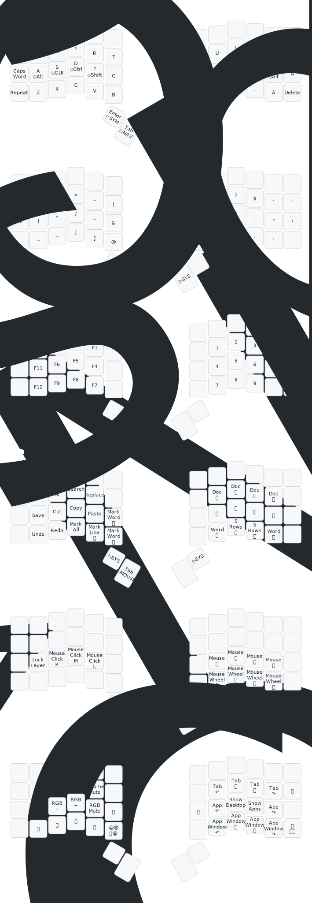

# Symmetra W H

QMK layout for my ZSA Voyager.

I have deliberately chosen not to use the top row of the Voyager, partly to _stay_ forward-compatible with other 3×6 + thumb key layouts, and partly to reduce finger travel.  

My alternative alpha layout of choice is the [Swedish Kvikk Layout](https://lykt.xyz/skl/kvikk/), QWERTY is also supported.

## Keywords

`qwerty`, `kvikk`, `win`, `mac`, `nordic`, `swedish`, `40-keys`, `symmetrical`, `homerow-mods`, `vim-navigation`, `mouse-layer`, `edit-cluster`, `OS-toggle`, `alpha-toggle`

## Layers

## Key Translations

Legend for symbols and special keys used in the SVG:

| Symbol    | Meaning                           |
|-----------|-----------------------------------|
| ◇         | Modifier                          |
| ▷         | Momentary Layer toggle            |
| 🔍        | Windows search / Spotlight        |
| 😀😎🤔😭 | Emoji menu                         |
| 🔒        | Lock screen                       |
| 🔄🪟🍏    | Toggle OS (Win/Mac)               |
| 🔄⚪⚡     | Toggle alpha layer (QWERTY/Kvikk) |
| 📸        | Screenshot                        |
| ⏮️        | Previous track                    |
| ⏭️        | Next track.                       |
| ⏹️        | Stop                              |
| ⏯️        | Play/Pause                        |

## Visualization Pipeline

The QMK keymap.c is converted into a visual representation of all layers. qmk c2json generates a JSON file, a custom Python script (yamlFromJson.py) converts it to YAML with readable layer names and symbolic keys, and keymap-drawer produces the SVG.

The shell script visualize.sh automates all steps: creating a temporary symlink, generating JSON and YAML, and producing the SVG.

**Dependencies:**  
- QMK CLI (`qmk c2json`)  
- `keymap-drawer` Python module  
- Custom Python script: `yamlFromJson.py`  
- Shell script: `visualize.sh`